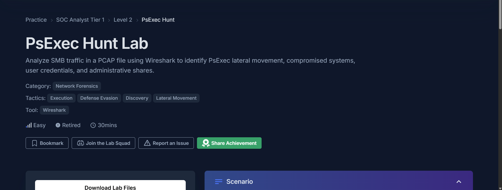
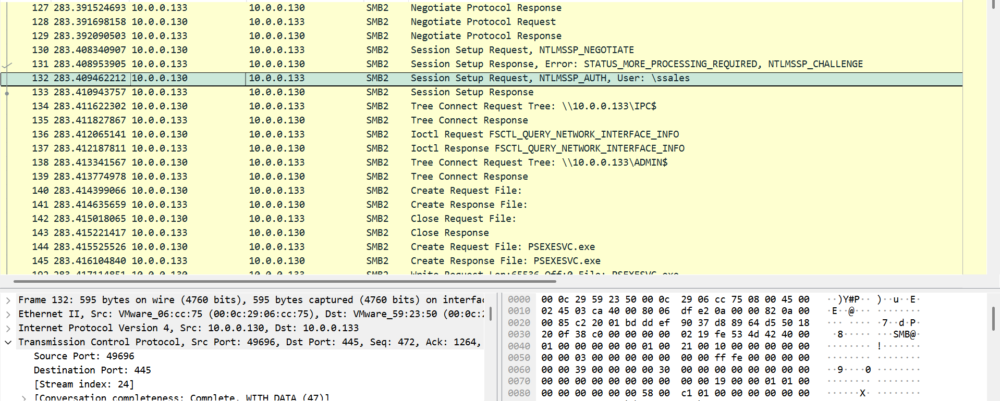
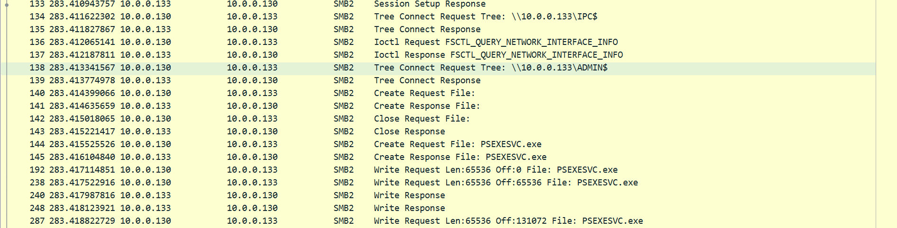
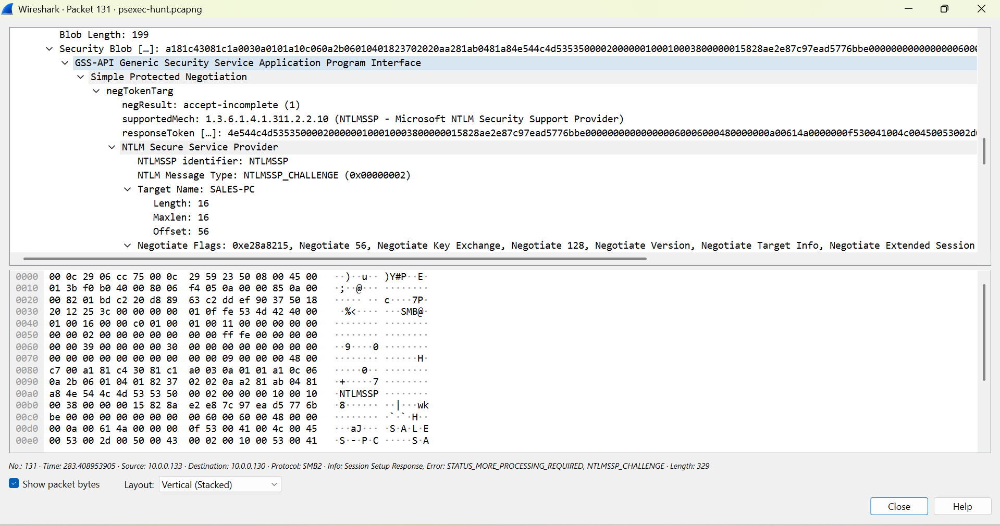
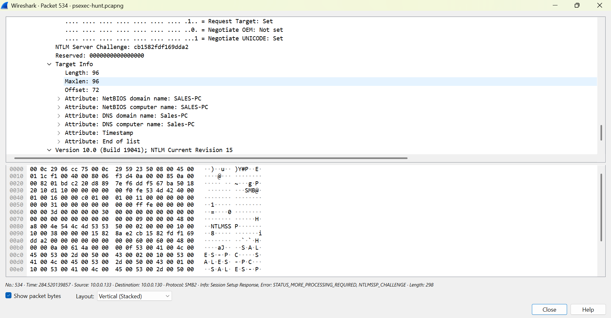
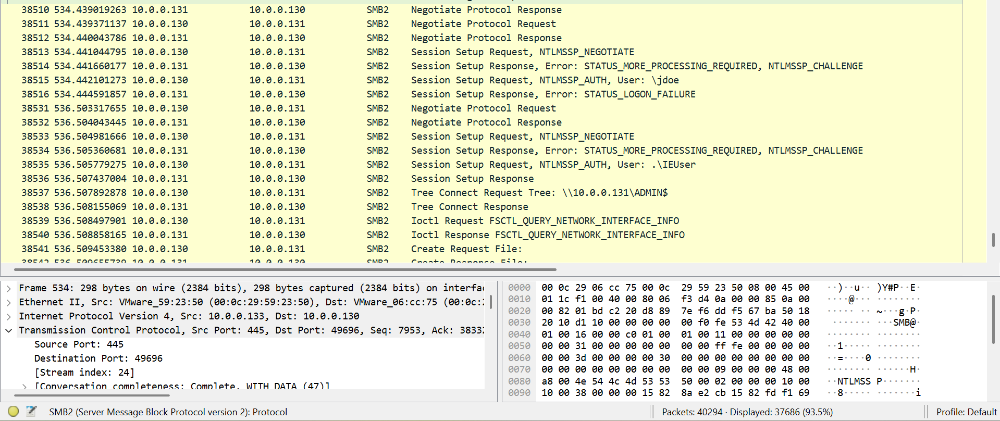
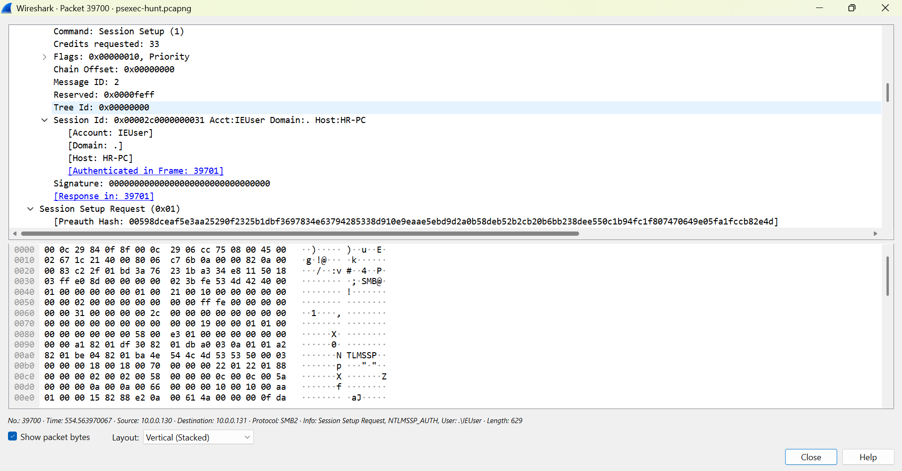
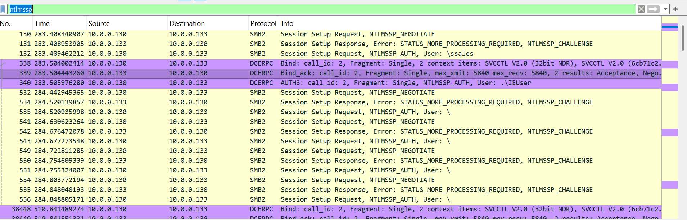

# SOC Incident Investigation Case Study: Investigating PsExec Hunt Lab

**Platform:** CyberDefenders SOC Analyst Tier 1, Level 2 **Category:** Network Forensics **Tactics:** Execution, Defense Evasion, Discovery, Lateral Movement **Tool:** Wireshark **Difficulty:** Easy | **Time:** 30 mins **Lab Reference:** [PsExec Hunt CyberDefenders](https://cyberdefenders.org/blueteam-ctf-challenges/psexec-hunt/)
## Scenario

An alert from the Intrusion Detection System (IDS) flagged suspicious lateral movement activity involving PsExec. This indicates potential unauthorized access and movement across the network. As a SOC Analyst, your task is to investigate the provided PCAP file to trace the attacker's activities. Identify their entry point, the machines targeted, the extent of the breach, and any critical indicators that reveal their tactics and objectives within the compromised environment.

## Investigation

The investigation starts by identifying the host responsible for the suspicious lateral movement activity. A Wireshark filter was applied to display only SMB communication in wireshark. Suspicious activity showed that the IP 10.0.0.130 starts a SMB negotiate protocol request towards IP 10.0.0.133.

in packet 132, the IP 10.0.0.130 sends a session setup requests and by inspecting the packet. It seems that the host HR-PC is the device that has been compromised based by the scenario and is now currently using the account ssales on that host. After the session setup response, a tree connect request tree was sent by the IP 10.0.0.130 to 10.0.0.133 IPC$ with success status, a tree connect request and response means that the server gives the client all information about access authorization for the requested SMB share. If the share name has a $ at the end like IPC$, it means the share is hidden, usually the system creates hidden shares, but users can create them too.

The attacker then proceeds to make a tree connect request to the ADMIN$ share on 10.0.0.133. The connection proves successful based on tree connect response after the request. Shortly afterward, the attacker create a request file named PSEXESVC.exe.

At this point, the destination IP address had been identified, but the destination IP hostname target machine had not been identified. In order to identify the target hostname, the provided hint was followed by applying the ntlmssp.challenge.target_name filter in Wireshark. The result of NTLMSSP Challenge contained target information such as NetBIOS Domain Name and NetBIOS Computer Name, both identifying the machine as SALES-PC. Since the challenge originated from 10.0.0.133, i correlated the 10.0.0.133 IP with SALES-PC.

The investigation then showed that 10.0.0.130 initiated another SMB connection, but this time towards 10.0.0.131. The session setup exchange showed the IEUser account being used and response indicated a successful authentication. Further inspection of the second target information 10.0.0.131 as MARKETING-PC. Similar activity was observed on MARKETING-PC. The attacker successfully connected to the ADMIN$ share and created PSEXESVC.exe. This information shows that the attacker used different account for the SMB session to MARKETING-PC, the attacker used IEUSER while the earlier session to SALES-PC, the attacker used ssales account.

Further investigation of the authentication traffic revealed other accounts attempts againts SALES-PC and MARKETING-PC. The unnamed account tries to do an NTLMSSP authentication but received STATUS_MORE_PROCESSING_REQUIRED, STATUS_LOGON_FAILURE or STATUS_ACCESS_DENIED and another account named jdoe, experience a STATUS_MORE_PROCESING_REQUIRED and STATUS_LOGON_FAILURE. The ssales and IEUser accounts also experience STATUS_MORE_PROCESSING_REQUIRED before succeeding in the authentication process.

## PsExec Analysis

The SMB traffic provides multiple signs consistent with PsExec lateral movement. The attacker has succesfully create a connection to the ADMIN$ administrative share on both SALES-PC and MARKETING-PC. An SMB create request was observed for PSEXESVC.exe on each target host. PSEXESVC.exe is a service executable used to execute commands on a remote Windows host.

## Indicator of Compromise (IOC)

| Type | Indicator/Artifact | Description |
|---|---|---|
| IP Address | 10.0.0.130 | Compromissed host the attacker used to initiate SMB connections |
| Host | HR-PC | Compromissed host the attacker used to initiate lateral movement |
| IP Address | 10.0.0.133 | First target IP address |
| Host | SALES-PC | First target host |
| IP Address | 10.0.0.131 | Second target IP address |
| Host | MARKETING-PC | Second target host |
| Account | ssales | Account used during the SMB session with the first target, SALES-PC |
| Account | IEUser | Account used during the SMB session with the second target, MARKETING-PC |
| File | PSEXESVC.exe | Service executable created on both target hosts |

## MITRE ATT&CK Mapping

| Tactic | Techniques | Description | Evidence |
|---|---|---|---|
| Lateral Movement | T1021.002 Remote Services: SMB/Windows Admin Shares | Adversaries may use Valid Accounts to interact with a remote network share using Server Message Block (SMB). The adversary may then perform actions as the logged-on user | The attacker successfully connect to ADMIN$ on both targets, SALES-PC and MARKETING-PC |
| Execution | T1569.002 System Services: Service Execution | Adversaries may abuse the Windows service control manager to execute malicious commands or payloads. | PSEXESVC.exe was created and on both targets and used for service execution |

## Conclusion

Based on the investigation, firstly the attacker used a compromised name HR-PC at 10.0.0.130 and initiate SMB connection to SALES-PC (10.0.0.133) as part of its lateral movement. The attacker used available accounts on the HR-PC, for the first target SALES-PC the attacker used an account named ssales and successfully accessed the ADMIN$ share followed by creating PSEXESVC.exe. The attacker then continued the lateral movement to MARKETING-PC (10.0.0.131) using the IEUser account. Same as before, after the attacker successfuly access the ADMIN$, the attacker then creates PSEXECSVC.exe. In conclusion, the investigation identified HR-PC as the compromised host and SALES-PC and MARKETING-PC as the targeted hosts.

## Lesson Learned

From this lab, i learned how to analyze SMB traffic to identify lateral movement from a compromised hosts on the network. I learned how to correlate SMB and NTLMSSP traffic to identify target hosts and authentication attempts. This lab also helped me understand how ADMIN$ access and PSEXESVC.exe can be used as indicators for lateral movement based on PsExec.

## References

- https://www.prosec-networks.com/en/blog/smb-server-message-block-protokoll/
- https://learn.microsoft.com/en-us/openspecs/windows_protocols/ms-smb2/832d2130-22e8-4afb-aafd-b30bb0901798
- https://attack.mitre.org/techniques/T1021/002/
- https://attack.mitre.org/techniques/T1569/002/
- https://learn.microsoft.com/en-us/openspecs/windows_protocols/ms-smb/6ab6ca20-b404-41fd-b91a-2ed39e3762ea
- https://learn.microsoft.com/en-us/openspecs/windows_protocols/ms-smb2/fb188936-5050-48d3-b350-dc43059638a4
- https://learn.microsoft.com/en-us/sysinternals/downloads/psexec
- https://www.wireshark.org/docs/dfref/n/ntlmssp.html
