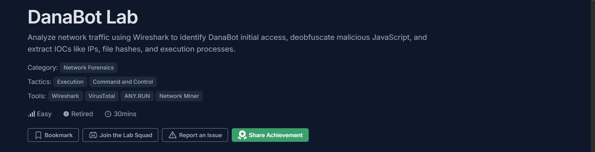
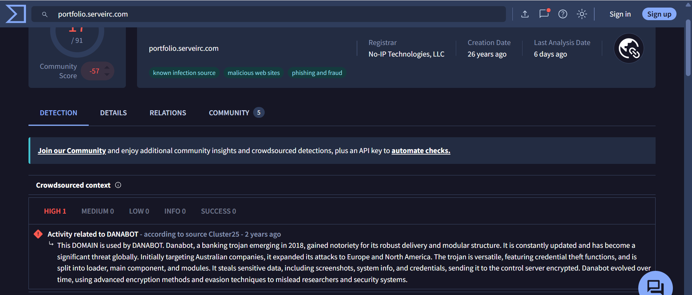
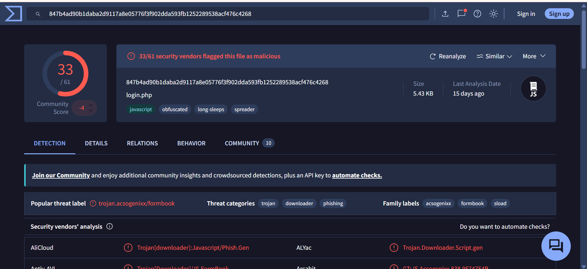
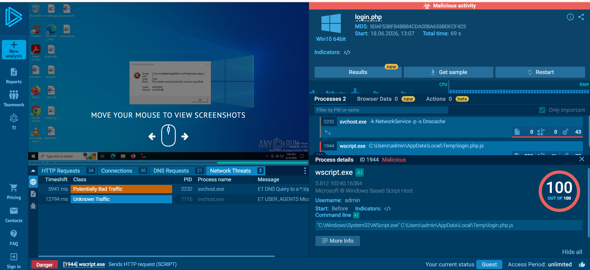
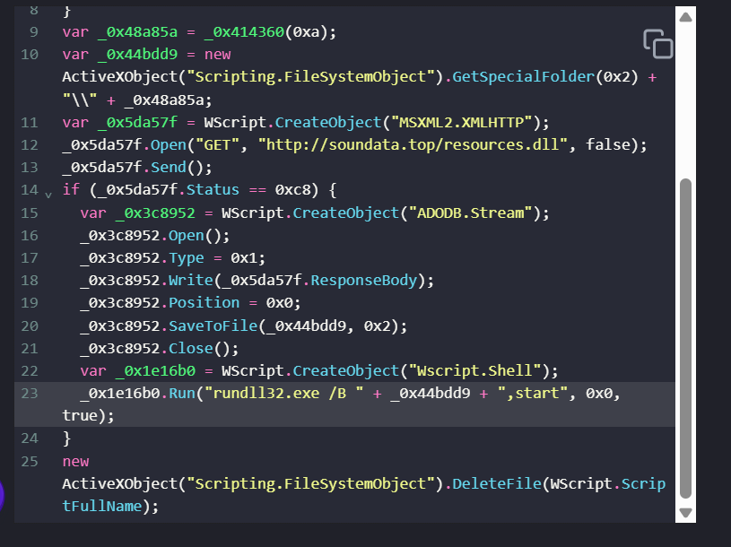
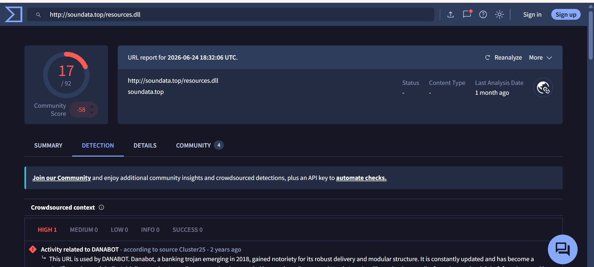
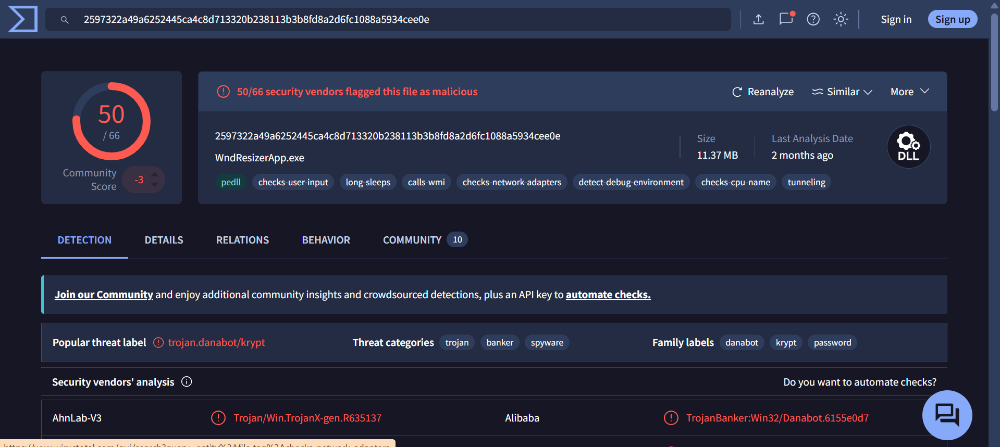

# SOC Incident Investigation Case Study: Investigating DanaBot

**Platform:** CyberDefenders — SOC Analyst Tier 1, Level 3
**Category:** Network Forensics
**Tactics:** Execution, Command and Control
**Tools:** Wireshark, VirusTotal, ANY.RUN, NetworkMiner
**Difficulty:** Easy | **Time:** 30 mins
**Lab Reference:** [DanaBot CyberDefenders](https://cyberdefenders.org/blueteam-ctf-challenges/danabot/)

## Scenario

The SOC team has detected suspicious activity in the network traffic, revealing that a machine has been compromised. Sensitive company information has been stolen. Your task is to use Network Capture (PCAP) files and Threat Intelligence to investigate the incident and determine how the breach occurred.

## Investigation

The investigation start by examining the PCAP file in Wireshark. A DNS filter was applied first to identify the initial network activity. The earliest DNS query shows that the victim host 10.2.14.101 attempted to resolve the domain 'portfolio.serveirc.com'. Since the domain itself was unfamiliar, it was verified using VirusTotal. The result shows that the domain itself had been flagged malicious by multiple vendor and associated with DanaBot.

The next step is to inspect the communication between traffics by following the TCP/HTTP stream. During the analysis, the sixth packet contained a HTTP GET request for login.php. However, instead returning a HTML login page, the server responded with an attachment named allegato_708.js, specified in the Content-Disposition header. To further investigate the file, the HTTP Objects list in Wireshark was checked and examined. The size of the login.php appeared unusual, so the file was exported and moved to a virtual machine environment. For safety, the file extension was changed from .php to .txt to prevent accidental execution that might occur while inspecting its content.

The SHA 256 hash of the login.txt file was calculated by the sha256sum tool and the hash (847b4ad90b1daba2d9117a8e05776f3f902dda593fb1252289538acf476c4268) was submitted to VirusTotal. The result confirmed that the file was malicious and associated with DanaBot. Upon opening the text file, the Javascript source code appeared obfuscated, making it difficult to understand. In order to fix this, the script was process using an online Javascript deobfuscation tool. The deobfuscated output shows the logic of the script, this allows further analysis.

## Javascript Payload Analysis

The Javascript itself was heavily obfuscated, making it difficult for me to understand on how the script works. After the script was deobfuscate, i examined several parts of the code to understand what the file was doing to the computer. I searched the SHA-256 hash of the extracted JavaScript in ANY.RUN public reports. The report shows that the JavaScript was executed by wscript.exe.

While reading the code, The first part that caught my attention is Wscript.CreateObject (MSXML2.XMLHTPP) object and sent a GET request to soundata.top/resources.dll. After a little bit of searching, i found out that Wscript.CreateObject() is a windows script host method that can be used by JScript to create an instanse of a COM object. Another finding is that MSXML2.XMLHTTP was used to send an HTTP request and receive the response. Based on my understanding, this function creates a GET request to the soundata.top domain and request the file resources.dll, the domain was also checked using VirusTotal.

Based on the information, this domain is also related to DanaBot. Once received the HTTP response, the script creates an ADODB.Stream object using WScript.CreateObject(). ADODB.Stream function is for working with data as a stream, the script then writes _0x5da57f.ResponseBody into the stream and saves it using SaveToFile(). Based on this behavior itself, i determined that the response from resources.dll was being written to a file on the victim system.

The script then creates a WScript.shell object and uses its Run() method to execute rundll32.exe. The DLL file is recorded in wireshark and the object can be exported, once i exported i checked the MD5 hash (e758e07113016aca55d9eda2b0ffeebe). Based on the result of VirusTotal, this hash is associated to DanaBot and has been flagged malicious. The last function of the javascript uses Scripting.FileSystemObject, it seems that this function is to remove the current running Javascript file after the downloaded DLL is launched.

## Indicator of Compromise (IOC)

| Type | Indicator/Artifact | Description |
|---|---|---|
| IP Address | 10.2.14.101 | Victim IP Address |
| Domain | 'portfolio.serveirc.com' | Domain contacted by the victim |
| IP Address | 62.173.142.148 | DNS response for portofolio.serveirc.com |
| URL | /login.php | HTTP GET request in PCAP |
| File | allegato_708.js | Filename indicated by the HTTP response's Content-Disposition |
| File Artifact | login.php | The exported object's contents contained the JavaScript payload |
| Hash (SHA256) | 847b4ad90b1daba2d9117a8e05776f3f902dda593fb1252289538acf476c4268 | SHA-256 hash of the exported JavaScript payload, checked against VirusTotal and identified as malicious/associated with DanaBot |
| Domain | soundata[.]top | Remote domain contacted by the JavaScript payload to retrieve the second stage DLL |
| URL | 'hxxp://soundata[.]top/resources[.]dll' | HTTP GET request specified in the deobfuscated JavaScript for downloading the DLL payload |
| File | resources.dll | Second stage DLL downloaded by the JavaScript payload |
| Hash (MD5) | e758e07113016aca55d9eda2b0ffeebe | MD5 hash of the exported DLL |
| Process | wscript.exe | Windows Script Host process observed in the public sandbox report executing the JavaScript payload |
| Process | rundll32.exe | Execution the downloaded DLL |

## MITRE ATT&CK Mapping

| Tactic | Techniques |
|---|---|
| Execution | T1059.007 Command and Scripting Interpreter: JavaScript |
| Stealth | T1218.011 System Binary Proxy Execution: Rundll32 |
| Stealth | T1070.004 Indicator Removal: File Deletion |
| Command and Control | T1105 Ingress Tool Transfer |

## Conclusion

Based on the investigation, the compromised host at 10.2.14.101 communicated with infrastructure associated with DanaBot. The HTTP traffic shows a malicious JavaScript payload delivered through a request to /login.php. After deobfuscation process, the script was found to download resources.dll from soundata.top, save the response to the filesystem and use rundll32.exe to execute the downloaded DLL. Threat intelligence results supports the correlation between the identified domains and file hashes with DanaBot.

## Lesson Learned

From this lab, i learned the importance of correlating network traffic, file analysis and threat intelligence. By connecting the HTTP response with the Javascript payload, the downloaded DLL, execution behavior and threat intelligence results, i was able to build a more complete understanding regarding the incident. I also learned that static analysis can helped provide valuable insight into malware behavior without executing the sample itself.

## References

- https://learn.microsoft.com/en-us/office/client-developer/access/desktop-database-reference/savetofile-method-ado
- https://learn.microsoft.com/en-us/windows/win32/com/using-com-objects-in-windows-script-host
- https://learn.microsoft.com/en-us/previous-versions/windows/desktop/ms759148(v=vs.85)
- https://attack.mitre.org/techniques/T1059/007/
- https://attack.mitre.org/techniques/T1218/011/
- https://attack.mitre.org/techniques/T1105/
- https://attack.mitre.org/techniques/T1070/004/
